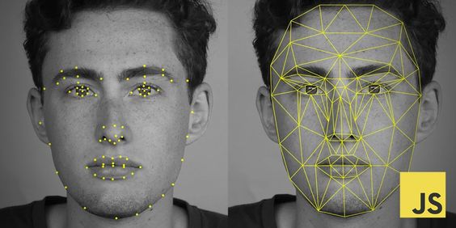
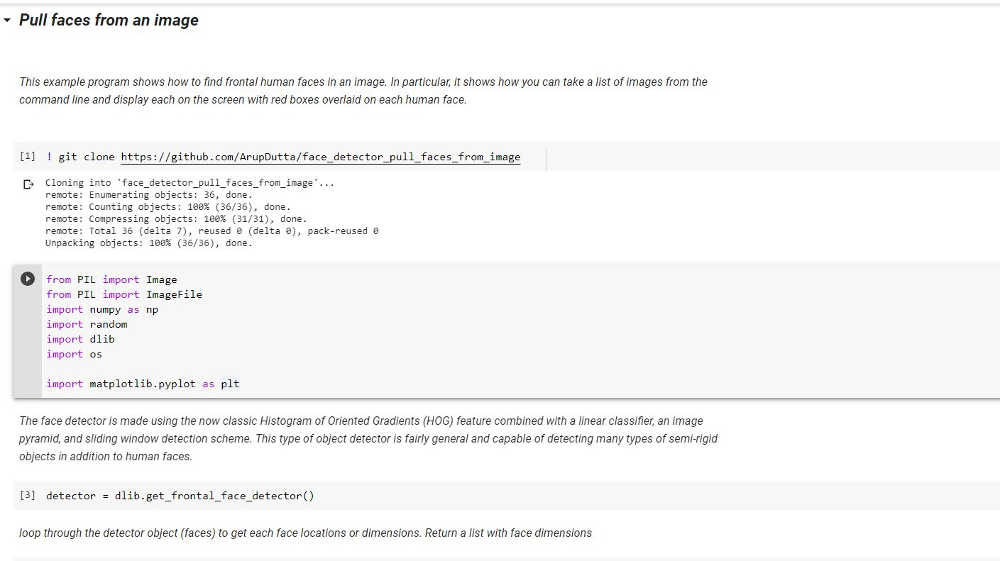

# image_processing_pull_faces_from_images

## Brief Summary
*Last updated: 03-08-2020 with Dlib*

*This repository is an extension to my last repository [Object Detection-single object](https://github.com/ArupDutta/Object-Detection_single-object). This tutorial explains how to detect and pull a face from an image and save it individually. Google colab online editer is being used for the coding.*

*Note: This will run in all platform (windows, linux). Make sure to have an google colab account, Its free. Follow [Getting Started with Google Colab](https://www.youtube.com/watch?v=i-HnvsehuSw) to getting started with it.*

  

## Introduction
Image processing is a method to perform some operations on an image, in order to get an enhanced image or to extract some useful information from it. It is a type of signal processing in which input is an image and output may be image or characteristics/features associated with that image. Nowadays, image processing is among rapidly growing technologies. It forms core research area within engineering and computer science disciplines too.

Image processing basically includes the following three steps:

Importing the image via image acquisition tools;
Analysing and manipulating the image;
Output in which result can be altered image or report that is based on image analysis.

The sole purpose of this tutorial is to show and explain how easily to create an image processing/face detection algorithm using dlib API, without any complex installation that can easily pull individual faces from an image. At the end the images are saved separately for later review.

## Steps
### 1. Configure Project
Follow [*Anaconda Installation Video*](https://www.anaconda.com/distribution/#download-section), which shows the process for installing Anaconda. Visit [*Dlib*](http://dlib.net/python/index.html), [*PIL Website*](https://pillow.readthedocs.io/en/stable/reference/Image.html) for personal studies.

Download the [*face_detector_pull_faces.ipynb*](https://github.com/ArupDutta/face_detector_pull_faces_from_image/blob/master/face_detector_pull_faces.ipynb) file from repository, upload it to your google colab and you are good to go with your Project Configuration.

At this point, here is what *object detection* folder should look like:

  

### 2. Clone Face Detection Repository from GitHub
Once the face detector_pull faces.ipynb file is opened, execute the code block step by step carefully.
Clone the full [*Face detection repository*](https://github.com/ArupDutta/face_detector_pull_faces_from_image) to your current runtime from GitHub.

### 3. Important Libraries and Functions
   #### a. [*PIL*](https://pillow.readthedocs.io/en/stable/reference/Image.html) library to loads image into PIL format
   #### b. [*Matplotlib*](https://matplotlib.org/) is a comprehensive library for creating static, animated, and interactive visualizations in Python
   #### c. OS library allows to loop through each image in the directory
   #### d. [*numpy*](https://numpy.org/doc/stable/user/basics.creation.html) to create an array
   #### e. [*Dlib*](http://dlib.net/python/index.html) imports the face detector. The face detector is made using the now classic Histogram of Oriented Gradients (HOG) feature combined with a linear classifier, an image pyramid, and sliding window detection scheme. This type of object detector is fairly general and capable of detecting many types of semi-rigid objects in addition to human faces.
   
   
Happy Learning 👍 

### Connect with me:

